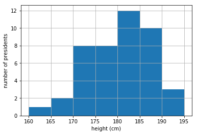

# Histograms in Python

Histograms are very commonly used to show the frequency at which different values (or ranges of values) occur in a data set.  They involve dividing the values into a series of intervals or *'bins'* and counting how many values fall into each interval.

As an example, we are going to look at the heights of the 44 different US presidents. In the code below a list of these values is created, which is then transformed into an array (data taken from [Wikipedia](https://en.wikipedia.org/wiki/Heights_of_presidents_and_presidential_candidates_of_the_United_States)).

``` python
import numpy as np
import matplotlib.pyplot as plt

height_list = ([193, 192, 191, 189] + 5*[188] + 4*[185] +6*[183] + 4*[182] +
              2*[180] + [179] + 4*[178] + [177] + 2*[175] + [174] + 4*[173] +
              [171] + 2*[170] + 2*[168] + [163]) # heights of US presidents in cm

height_array = np.array(height_list)
```
Here a couple of tricks have been used. First, the parentheses `()` surrounding the list allow splitting up the long statement into multiple lines. 

Second, you may remember from last week that when you added two lists together they were concatenated, i.e. *'chained together'*, rather than added element-wise. Similarly, if you multiply a list by a constant then the elements of the list are repeated the specified number of times.  For example, since there have been 6 US presidents with a height of 183 cm, this can be abbreviated to `6*[183]` when forming a list.  The `+` signs then link all these terms together to form one list.

As a result, the `height_array` variable therefore contains 44 elements, one for the height of each president, i.e.

``` python
In [2]: height_array

Out[2]:
array([193, 192, 191, 189, 188, 188, 188, 188, 188, 185, 185, 185, 185,
183, 183, 183, 183, 183, 183, 182, 182, 182, 182, 180, 180, 179,
178, 178, 178, 178, 177, 175, 175, 174, 173, 173, 173, 173, 171,
170, 170, 168, 168, 163])
```

Now we will plot a histogram of this data by using the `plt.hist()` function.  To do this we will pass this function two parameters.  The first parameter is the data we wish to make a histogram from; namely `height_array` in this case. 

The second parameter is another array which contains the position of the bin edges. We will choose the bin edges to be at 160, 165, 170,... so the `np.linspace()` function is perfect for creating this array. Note that the bin intervals (except the final, right-most bin) are half-open.  For example the first bin is [160, 165) which includes all values from 160 up to, but not including, 165.  165 is instead included in the second bin, which is [165, 170).  The final bin in this case is [190, 195], which includes both 190 and 195. 
``` python
bin_edges = np.linspace(160, 195, 8) # will be used to define bin edge positions on histogram

plt.hist(height_array, bins = bin_edges)
plt.grid(True) # includes gridlines on the plot
plt.xlabel("height (cm)")
plt.ylabel("number of presidents")
```


Here we can see for example that 1 president has a height between 160 cm and 165 cm (not including 165 cm), whereas 12 presidents have a height between 180 cm and 185 cm (not including 185 cm).

[Next: Mean, variance and standard deviation](phy1003/week-2/mean-variance-std.md)