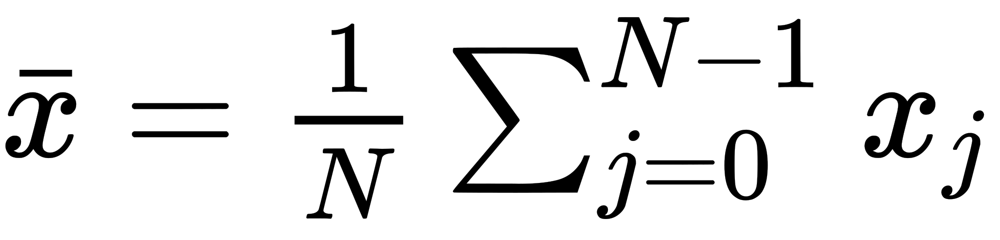
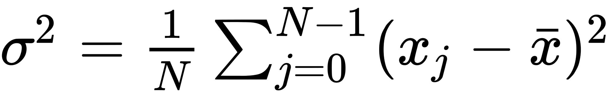

# Mean, variance and standard deviation

## Mean

The mathematical formula for the mean of a set of *N* numbers *x = {x<sub>0</sub>, x<sub>1</sub>, ..., x<sub>N-1</sub>* is given by

.

In Python you can calculate the mean either using this equation directly or by using the `np.mean()` function.  For example, the mean height of the US presidents studied previously can be calculated as follows: 

```python
In [12]: np.sum(height_array) / len(height_array)
Out[12]: 180.11363636363637

In [13]: np.mean(height_array)
Out[13]: 180.11363636363637
```

## Variance


The variance, σ<sup>2</sup> is the average square deviation from the mean and can be calculated by using the following equation

,

or by using the `np.var()` function.

``` python
In [14]: np.sum((height_array - np. mean(height_array)) ** 2) / len(height_array)
Out[14]: 49.32799586776859

In [15]: np.var(height_array)
Out[15]: 49.32799586776859
```

## Standard deviation

The standard deviation can be found by taking the square root of the variance or by using the `np.std()` function.

``` python
In [16]: np.sqrt(np.sum((height_array - np. mean(height_array)) ** 2) / len(height_array))
Out[16]: 7.023389200932026

In [17]: np.std(height_array)
Out[17]: 7.023389200932026
```
