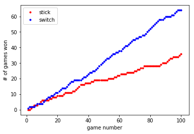

# The Monty Hall problem

The Monty Hall problem is a puzzle based on an American game show *'Let's Make a Deal'* named after its original host, Monty Hall.  The problem is stated as follows (source [Wikipedia](https://en.wikipedia.org/wiki/Monty_Hall_problem)):

*"Suppose you're on a game show, and you're given the choice of three doors: Behind one door is a car; behind the others, goats. You pick a door, say No. 1, and the host, who knows what's behind the doors, opens another door, say No. 3, which has a goat. He then says to you, "Do you want to pick door No. 2?" Should you switch?"*

The solution to this problem, which may seem counterintuitive, is that you should agree to the switch every time, since that strategy give a 2/3 chance of winning. To demonstrate that this is true however, you could use a Monte Carlo simulation as shown below. Note that this is not the only way to solve the problem, and also includes a few lines of code that aren't completely neccessary (but these are included to keep whats happening in the simulation quite close to the original game).

``` python
import numpy as np
import matplotlib.pyplot as plt

num_games = 100 # number of games
stick_wins = 0 # number of times stick strategy wins
switch_wins = 0 # number of times switch strategy wins

# run simulations
for i in range(num_games):
    doors = ['car', 'goat', 'goat'] # creates the doors
    np.random.shuffle(doors) # randomly changes the position of prizes

    picked_number = np.random.randint(0,3) # contestant chooses a door
    picked_door = doors.pop(picked_number) # removes the guessed door from the list and stores it

    np.random.shuffle(doors)
    doors.remove('goat') # one of the goat doors is removed by the host

    # last unopened door
    remaining_door = doors[0]

    # the contestant now has two choices, to choose the picked_door which was the original choice, or to switch to the remaining door.
    # the stick strategy wins if the original pick has the car and the switch strategy wins if the remaining door has the car
    # checks which strategy wins
    if picked_door == 'car':
        stick_wins += 1
    else:
        switch_wins += 1

    # each iteration of the loop, we plot the cumulative value for the wins of each strategy as two dots
    plt.plot(i+1, stick_wins, '.r')
    plt.plot(i+1, switch_wins, '.b')
    plt.xlabel("game number")
    plt.ylabel("# of games won")
    plt.legend(['stick', 'switch'])

print(f"The probability that switch strategy wins is {switch_wins/num_games}")
```

This code gives the output:

``` python 
The probability that switch strategy wins is 0.64
```
