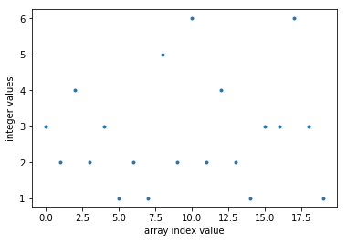
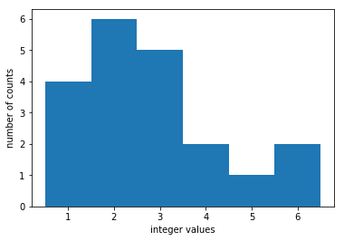
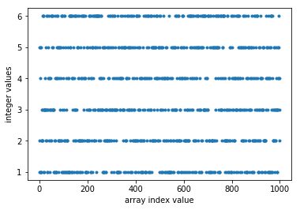
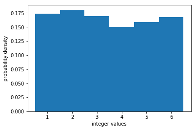
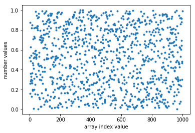
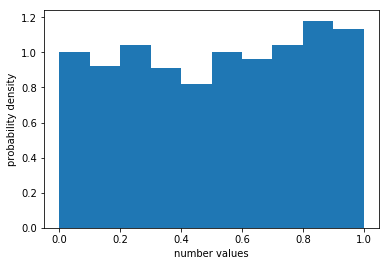
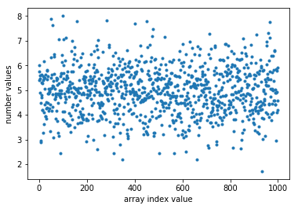
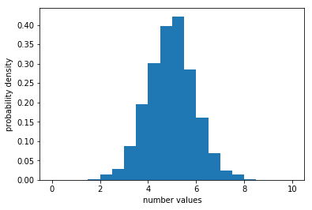

# Random number generation in Python


## The discrete uniform distribution

The `np.random.randint(low, high, size)` function is used to generate random integers between `low` and `high - 1`. Each integer within the range is equally likely to appear (i.e. we are drawing integers from the *discrete uniform distribution*). If the `size` parameter is omitted, then one random integer will be generated, e.g.
``` python
In [1]: import numpy as np

In [2]: np.random.randint(1, 11) # generates a random number between 1 and 10, inclusive
Out[2]: 9

In [3]: np.random.randint(1, 11) # generates a new random number between 1 and 10, inclusive
Out[3]: 4

In [4]: np.random.randint(100, 201) # generates a random number between 100 and 200, inclusive
Out[4]: 133
```
If we set the `size` parameter to an integer, then this function will generate an array of random integers, with `size` number of elements. In the following code, the line `random_integers = np.random.randint(1, 7, 20)` generates an array of 20 random integers between 1 and 6 inclusive. These numbers are printed to the console, then plotted versus their array index value (this is the default setting if you don't include x-values in the `plt.plot()` function) and also as a histogram.   Note here that the bin edges are set to half-integer values, so that the bin centre is on the integers.

``` python
import numpy as np
import matplotlib.pyplot as plt

random_integers = np.random.randint(1, 7, 20) #generates an array of 20 random integers between 1 and 6 inclusive

print(f'Randomly generated integers: {random_integers}') #prints the array of random integers to the console

plt.plot(random_integers, '.') #plots the generated integers versus array index value
plt.xlabel('array index value')
plt.ylabel('integer values')
plt.show() #displays the figure in the console

plt.hist(random_integers, bins = np.linspace(0.5, 6.5, 7)) #plots a histogram of the random_integers
plt.xlabel('integer values')
plt.ylabel('number of counts')
```
```
Randomly generated integers: [3 2 4 2 3 1 2 1 5 2 6 2 4 2 1 3 3 6 3 1]

```



If we increase the number of random integers generated, the distribution typically becomes more uniform, as shown below. The optional `density = True` parameter can be used to normalize this histogram such that its area is 1. This turns the plot into a probability density function. This is achieved by dividing the count by the total number of values times the bin width.
``` python
random_integers = np.random.randint(1, 7, 1000)

plt.hist(random_integers, bins = np.linspace(0.5, 6.5, 7), density = True)
```



## The uniform distribution

The `np.random.uniform(low, high, size)` function draws random real numbers between `low` and `high` (including low but excluding high) from the uniform distribution. For example, if you wanted to generate 1000 random real numbers from the uniform distribution between 0 and 1 you could run the following program.

``` python
import numpy as np
import matplotlib.pyplot as plt

random_numbers = np.random.uniform(0, 1, 1000) # generates 1000 random real numbers from the uniform distribution between 0 and 1

plt.plot(random_numbers, '.') #plots the generated integers versus array index value
plt.xlabel('array index value')
plt.ylabel('number values')
plt.show() #displays the figure in the console

plt.hist(random_numbers, bins = np.linspace(0, 1, 11), density = True) #plots a histogram of the random_numbers
plt.xlabel('number values')
plt.ylabel('probability density')
```





## The normal distribution

The `np.random.normal(loc, scale, size)` function draws random real numbers from the normal distribution (also known as the Gaussian distribution), defined by


Here the `loc` and `scale` parameters specify the mean x̄ and standard deviation σ, respectively.  You could use this distribution when you want the random numbers to cluster around a specified value.  For example, if you wanted to generate 1000 random real numbers sampled from a normal distribution centred at x̄ = 5 and with a standard deviation σ = 1 you could use the following code which produces the output below.

``` python
import numpy as np
import matplotlib.pyplot as plt

random_numbers = np.random.normal(loc = 5, scale = 1, size = 1000) # generates 1000 random real numbers sampled from a normal distribution centered at 5, with a standard deviation of 1

plt.plot(random_numbers, '.') # plots the generated numbers versus array index value
plt.xlabel('array index value')
plt.ylabel('number values')
plt.show() # displays the figure in the console

plt.hist(random_numbers, bins = np.linspace(0, 10, 21), density = True)
plt.xlabel('number values')
plt.ylabel('probability density')
```


