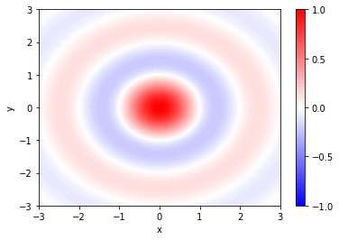

# Filled contour plots

By using the `np.meshgrid()` to create our co-ordinate arrays, plotting 2D data in Python is quite straightforward by using the `plt.contourf()` (filled contour) function.  This is illustrated in the following example, which plots the function .  The different possible `cmap` (colormap) parameters are shown in the [matplotlib documentation](https://matplotlib.org/tutorials/colors/colormaps.html).

``` python
import numpy as np
import matplotlib.pyplot as plt

x = np.linspace(-3, 3, 100)
y = np.linspace(-3, 3, 100)

xx, yy = np.meshgrid(x,y) # creates and stores coordinates of grid
z = np.sinc(np.sqrt(xx**2 + yy**2)) # calculates sinc function from xx and yy coordinates

plt.contourf(xx, yy, z, cmap = 'bwr', levels = np.linspace(-1,1,101)) # plots data, specifies colormap with 101 shades for z values between -1 and 1
plt.colorbar(ticks = [-1,-0.5, 0, 0.5, 1]) # adds color bar to figure
plt.xlabel("x")
plt.ylabel("y")
```



## Exercise 3:

Make a 2D contour plot of z(x,y) = sin(x)cos(y) for x = [-5π, 5π] and y = [-2π, 2π]
