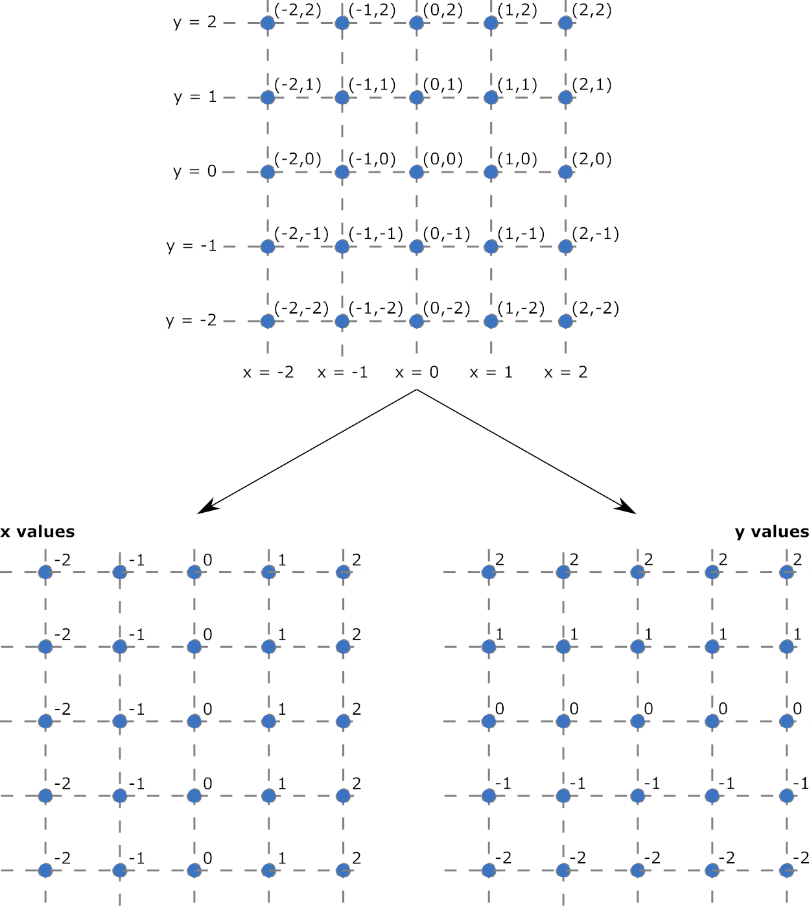

# Creating Cartesian grid points

One very useful function for plotting 2D functions in Python is `np.meshgrid(x,y)` which generates a Cartesian grid.  Here you input two 1D arrays, `x` and `y` which indicate the range of values you want the respective axes to cover. This function outputs two 2D arrays; one for the x-coordinates of every point on the grid and one for the y-coordinates of every point on the grid.  This is a little tricky but is best shown through an example:

``` python
In [1]: import numpy as np

In [2]: x = np.array([-2, -1, 0, 1, 2]) # grid points along x-axis

In [3]: y = np.array([-2, -1, 0, 1, 2]) # grid points along y-axis

In [4]: xx, yy = np.meshgrid(x, y)

In [5]: xx # x-coordinates of grid points
Out[5]:
array([[-2, -1, 0, 1, 2],
       [-2, -1, 0, 1, 2],
       [-2, -1, 0, 1, 2],
       [-2, -1, 0, 1, 2],
       [-2, -1, 0, 1, 2]])

In [6]: yy # y coordinates of grid points
Out[6]:
array([[-2, -2, -2, -2, -2],
       [-1, -1, -1, -1, -1],
       [ 0, 0, 0, 0, 0],
       [ 1, 1, 1, 1, 1],
       [ 2, 2, 2, 2, 2]])
```

To help visualize what the `np.meshgrid()` function does, the figure below shows how the x and y values from the Cartesian grid may be extracted. Compare this picture to the output from the code above.  Note that the y values are 'flipped' compared to the output on the console (for which column index increases as you go down, rather than up), but this does not have much impact when we are plotting our results.


