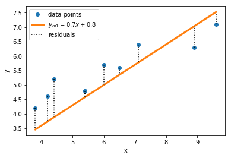
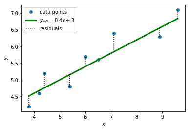

# Residuals

A *'residual'* is simply the difference between an observed data point and the model you are trying to fit to the data. Residuals may be visualized by the black, dotted lines below:



Mathematically, the i<sup>th</sup> residual may be written as r<sub>i</sub> = y<sub>i</sub> − f (x<sub>i</sub>) .  In our example, y<sub>i</sub> represents the i<sup>th</sup> value of the `y_obs` variable and f(x<sub>i</sub>) is the value predicted by our model at the i<sup>th</sup> `x_obs` value.  This can be calculated and printed in Python by appending the following code to the file.  Note here that we have made use of the fact that we can pass both individual values to our function, as well as an array (which we did on the previous page).

``` python
# calculates and prints the residuals for each model
residual_1 = y_obs - f(x_obs, 0.7, 0.8)
residual_2 = y_obs - f(x_obs, 0.4, 3)

print("Residuals ( model 1):", residual_1)
print("Residuals ( model 2):", residual_2)
```

``` python
Residuals (model 1): [ 0.22 0.63 0.7 0.22 0.86 0.25 1.32 -0.73 -0.42 0.74]
Residuals (model 2): [-0.36 0.56 0.3 -0.36 -0.08 0. 0.44 -0.26 0.26 -0.32]
```