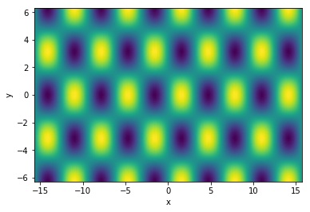

## Solution to Exercise 1:

``` python
import numpy as np
import matplotlib.pyplot as plt

def f(x, a, b, c):
    return a*np.exp(-(x-b)**2 / (2*c**2))

a = 2
b = 1
c = 4

print(f(4, a, b, c))

x_array = np.linspace(-15,15,1000)

plt.plot(x_array, f(x_array, a, b, c))
plt.xlabel("x")
plt.ylabel("f(x)")
```

## Solution to Exercise 2:

``` python
import numpy as np

def quadratic_roots(a, b, c):
    x1 = -b / (2*a) + np.sqrt(b**2 - 4*a*c) / (2*a)
    x2 = -b / (2*a) - np.sqrt(b**2 - 4*a*c) / (2*a)
    return x1, x2

root_1, root_2 = quadratic_roots(1,-2,-3)
print(f"Roots of equation are {root_1} and {root_2}")
```

## Solution to Exercise 3:

``` python
import numpy as np
import matplotlib.pyplot as plt

x = np.linspace(-5*np.pi, 5*np.pi, 100)
y = np.linspace(-2*np.pi, 2*np.pi, 100)
xx, yy = np.meshgrid(x, y)

z = np.sin(xx)*np.cos(yy)

plt.contourf(xx, yy, z, levels = np.linspace(-1,1,100))
plt.xlabel("x")
plt.ylabel("y")
```

