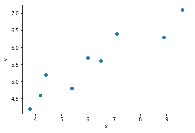
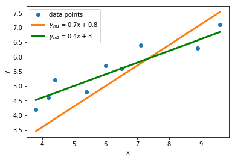

# Plotting trend lines

In this section, we're going to look at curve fitting. Let's start with an example. If we performed an experiment where we varied some parameter `x_obs` (the independent variable) and measured the resulting value of `y_obs` (the dependent variable), we could input and plot the data in Python using the following code.

``` python
import numpy as np
import matplotlib.pyplot as plt

# creates arrays of observed x and y values
x_obs = np.array([5.4, 7.1, 6.0, 5.4, 4.2, 6.5, 4.4, 8.9, 9.6, 3.8])
y_obs = np.array([4.8, 6.4, 5.7, 4.8, 4.6, 5.6, 5.2, 6.3, 7.1, 4.2])

# plots the data
plt.plot(x_obs, y_obs, 'o')
plt.xlabel('x')
plt.ylabel('y')
```


From inspecting the plot, you might come to the conclusion that there is a relationship between the `x_obs` and `y_obs` variables. In this case, and in many other practical examples, it is possible to visualize a smooth curve that approximates the data. In this example, the data seems to be approximated well by a straight line and we would say that there is a *'linear relationship'* between the variables. In general, you can fit other curves (not just straight lines) to data however we are going to focus on the linear case. This isn't as restrictive as it sounds. Linear relationships are very common in physics, at least over certain parameter ranges. Furthermore, even if the relationship is not linear, the variables can very often be transformed such that it becomes a linear problem.

To try and fit a straight line to this data (recall that the equation of line is given by y = mx + c), you might start by making guesses. For example, you might try and model your data using the lines y<sub>m1</sub> = 0.7x + 0.8 or y<sub>m2</sub> = 0.4x + 3 . Since we want to try a couple of lines with different gradients and intercepts, it makes sense to define a function here by appending the following code:

``` python
# function that defines our linear relationship y = mx+c, for gradient m and intercept c
def f(x, m, c):
    return m*x + c
```

This function will return the predicted values for our model. Here we want to create a trendline that covers not just the observation points, but all the points in between. Therefore, we create an array of possible x values, then pass this array to our function along with our chosen gradients and intercepts.  These lines can then be plotted as follows:

``` python
# creates predicted y values for the two models
x_model = np.linspace(np.min(x_obs), np.max(x_obs))
y_model_1 = f(x_model, 0.7, 0.8)
y_model_2 = f(x_model, 0.4, 3)

# plots the test lines
plt.plot(x_model, y_model_1, '-', linewidth = 3)
plt.plot(x_model, y_model_2, '-g', linewidth = 3)
plt.legend(['data points', '$y_{m1} = 0.7x + 0.8$', '$y_{m2} = 0.4x + 3$'])
``` 


Your intuition may tell you that y<sub>m2</sub> is a better fit to the observed data than y<sub>m1</sub>. However, it is helpful to have a quantitative measure of how well a given curve fits the observed data and we will define this shortly. After this measure is defined, we can use it to try and discover whether a **best** fitting line can be found. A good starting point for this is the concept of *'residuals'*.
