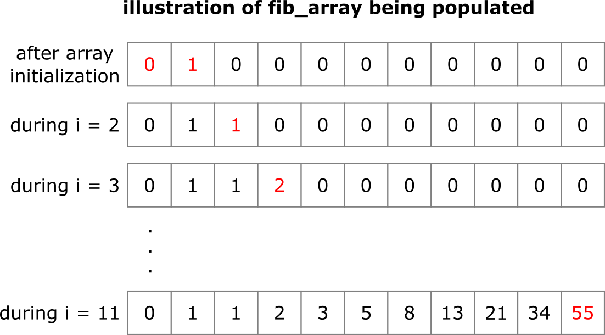

# Difference equations

In the well-known Fibonacci sequence, each term F<sub>n</sub> is defined as the sum of the previous two, i.e. LaTeX: F<sub>n</sub> = F<sub>n-1</sub> + F<sub>n-2</sub>, starting with LaTeX: F<sub>0</sub> = 0 and F<sub>1</sub> = 1.  This has parallels to the difference equations that we will use this week to numerically solve ordinary differential equations. In the code below, F<sub>10</sub> is calulated and printed to the console.

``` python
import numpy as np

n = 10 # nth Fibonacci number to calculate (must be integer > 1)

fib_array = np.zeros(n+1, dtype = np.uint64) # creates array to store Fibonacci numbers
fib_array[0] = 0 # defines zeroth Fibonacci number
fib_array[1] = 1 # defines first Fibonacci number

# calculates and populates each element of array iteratively
for i in range(2, n+1):
    fib_array[i] = fib_array[i-1] + fib_array[i-2]

print(fib_array[n]) # prints out nth Fibonacci number
```

This code is broadly structured in the following way:

* An array is created to store the results and the initial conditions are defined.
* A loop is set up which iteratively populates each cell based on previously calculated elements.
* The results are output.

This structure is used in many of the examples from this week so you should ensure that you understand how to create and populate the array.  An illustration of how this is achieved in this case is shown below. The numbers in red are added during the indicated iteration, based on the previous two values. 



## Why not generate Fibonacci via recursion?

An alternative method to generate the Fibonacci sequence is by using recursion, i.e. creating a function that calls itself.

``` python
def fib(n):
    """ calculates and returns the nth Fibonacci number by recursion """
    if n == 0: # defines zeroth Fibonacci number
        return 0
    elif n == 1: # defines first Fibonacci number
        return 1
    else:
        return fib(n-1) + fib(n-2) # calculates the two previous Fibonacci numbers

print(fib(10))
```
However, this approach is very inefficient because each time the `fib()` function is called, it generates two more calls to the `fib()` function, which in turn each generate two more calls.  This procedure continues until all the function calls are either `fib(0)` or `fib(1)`.  For high `n` numbers, this procedure will become very very slow.  As a reminder, you can always stop your program by pressing Ctrl + C non your keyboard!
