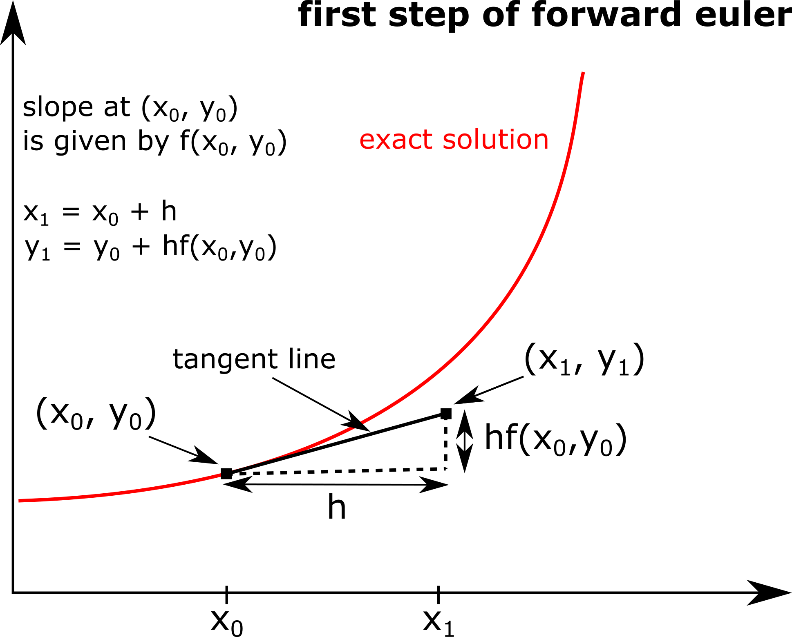

# Forward Euler method

The [Euler method](https://en.wikipedia.org/wiki/Euler_method) is a numerical technique for solving first-order ordinary differential equations of the form *y'(x) = f(x,y)*, given an initial condition *y(x0) = y0*. Most of these differential equations cannot be solved analytically by simple means but the solution can be approximated numerically.

The diagram below illustrates the idea behind the Euler method. Here you start with your given point on the solution *(x0, y0)*.  From the form of the differential equation you know that the gradient of the solution at *x0* is *f(x0,y0)* and you can form the tangent line.  For a step size *h* you take a new point *x1 = x0 + h*.  The value for *y1* at *x1* can then be approximated by assuming it is on the tangent line via *y1 = y0 + hf(x0,y0)*, which is valid for small values of *h*.  This process can then be iterated starting at the new point *(x1, y1)*

The Euler method can be written as difference equations as follows:

*xi+1 = xi + h*

*yi+1 = hf(xi, yi)*.