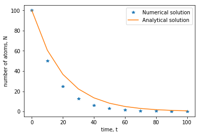

# Example: Radioactive decay

The Euler method is much easier to understand by looking at an example.  Here we seek to numerically solve the differential equation modelling radioactive decay, which is

*Ṅ(t) = -λN(t)*

where *Ṅ = dN/dt* is the rate of change in the number *N(t)* of radioactive atoms in a sample and *λ* is a positive constant. If we are given the initial condition then we can solve this equation numerically using the Euler method. To get the difference equations for the forward Euler scheme, you can compare terms with the differential equation on the previous page.  Alternatively, for the forward Euler method, you can first discretize the problem by writing *Ṅ ≈ ΔN/Δt = (N<sub>i+1</sub> - N<sub>i</sub>) / Δt = -λN<sub>i</sub>* for a constant *Δt = t<sub>i+1</sub> - t<sub>i</sub>*.  Rearranging this equation yields

*N<sub>i+1</sub> = N<sub>i</sub> -λN<sub>i</sub> Δt*

with

*t<sub>i+1</sub> = t<sub>i</sub> + Δt.*

These equations can then be solved iteratively, if we have our initial conditions.  Setting *N(0) = N<sub>0</sub> = 100*, *λ = 0.05* and *Δt = 10*, we can first do a few iterations by hand, starting at *t<sub>0</sub> = 0*:

|  i  |  t  | N |
|  -  |  -  | - |
|  *0*  |  *0* | *N<sub>0</sub> = 100* |
|   *1*    |   *10*    |    *N<sub>1</sub> = N<sub>0</sub> -λN<sub>0</sub> Δt = 50*  |
|   *2*    |    *20*   |   *N<sub>2</sub> = N<sub>1</sub> -λN<sub>1</sub> Δt = 25*    |
|   *3*    |    30*   |   *N<sub>3</sub> = N<sub>2</sub> -λN<sub>2</sub> Δt = 12.5*     |

However, this is a task much better suited to a computer!  We can use the general approach employed previously with the Fibonacci sequence and generate arrays to store our results. 

We will need two arrays; one for *t* and one for *N*.

* The *t* array can be populated at the start, because we know in advance what the time values will be. Here, because we specify the step size (rather than the number of steps) a good option is the `np.arange(start, stop, step)` function, which generates an array of evenly spaced values between `start`(inclusive) and `stop` (exclusive) with step size `step`.
* For *N* we will create an array of zeros, then set the value of *N[0] = N<sub>0</sub>* and populate the array using a loop which uses the Euler method with the difference relations above.

This can be implemented in Python as follows:

``` python
import numpy as np
import matplotlib.pyplot as plt

# fixed and initial parameters
k = 0.05 # decay constant
N0 = 100 # initial number of radioactive atoms
dt = 10 # step size
t_end = 100 # simulation end time

t = np.arange(0,t_end+dt,dt) # initialize array for time, between 0 and t_end inclusive, with step-size dt
num_timesteps = len(t)

# initialize array for solution, N
N = np.zeros(num_timesteps)

# Euler's method
N[0] = N0 # stores initial value
for i in range(num_timesteps-1): # runs for num_timesteps - 1 iterations
    N[i+1] = N[i] - k*N[i]*dt


plt.plot(t,N, '*') # Plots numerical soluation
plt.plot(t,N0*np.exp(-k*t)) # Plots analytical solution
plt.xlabel('time, t')
plt.ylabel('number of atoms, N')
plt.legend(['Numerical solution', 'Analytical solution'])
```



Here, the analytical solution given by *N(t) = N<sub>0</sub>e<sup>−λt</sup>* is plotted over the numerical solution.  Try running this code for a few different values of *N<sub>0</sub>*,  *λ* and *Δt* .  Here the decay constant has been named `k` rather than `lambda` to avoid conflict with a predefined Python operator.  Verify that when you decrease the value of *Δt*, the numerical solution gets closer to the analytical.