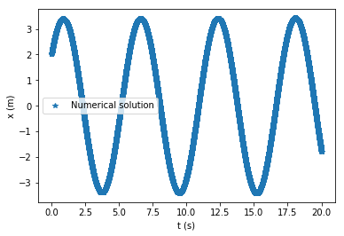
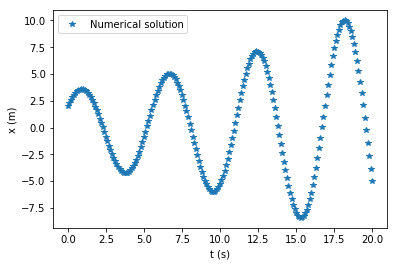
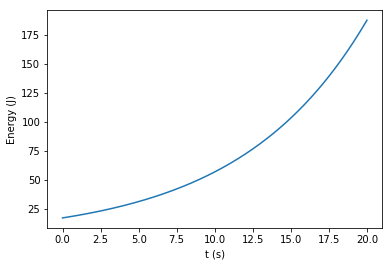
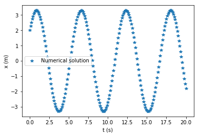
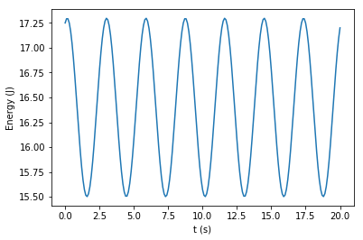
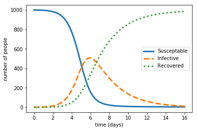

# Week 20 - Exercise Solutions

## Code for mass on a horizontal spring using Euler method

``` python
import numpy as np
import matplotlib.pyplot as plt

k = 3 # spring constant (N/m)
m = 2.5 # mass (kg)

x0 = 2 # initial position (m)
v0 = 3 # initial velocity (m/s)

dt = 0.001 # time step (s)
t_end = 20 # end time of simulation (s)

# initialize array for time, t
t = np.arange(0,t_end+dt,dt)
num_timesteps = len(t)

# initialize arrays for position and velocity
x = np.zeros(num_timesteps)
v = np.zeros(num_timesteps)

x[0] = x0
v[0] = v0

# Euler loop
for i in range(num_timesteps-1):
    x[i+1] = x[i] + v[i]*dt
    v[i+1] = v[i] - k/m*dt*x[i]


# plot the results
plt.plot(t,x,'*')
plt.xlabel('t (s)')
plt.ylabel('x (m)')
plt.legend(['Numerical solution'])
plt.show()

plt.plot(t, 0.5*m*v**2 + 0.5*k*x**2) # calculates and plots total energy
plt.xlabel('t (s)')
plt.ylabel('Energy (J)')
plt.show()
```
 

### Plot for dt = 0.001



### Plots for dt = 0.1

 

## Euler-Cromer loop and plots

``` python
# Euler-Cromer loop
for i in range(num_timesteps-1):
    v[i+1] = v[i] - k/m*dt*x[i]
    x[i+1] = x[i] + v[i+1]*dt
```
 

## Code for SIR model

 
``` python
import numpy as np
import matplotlib.pyplot as plt

a = 0.002 # infectivity constant
b = 0.4 # recovery constant
dt = 0.25
t_end = 16

S0 = 999 # number of susceptible people
I0 = 1 # number of infected people
R0 = 0 # number of recovered people

t = np.arange(0,t_end+dt,dt)
num_timesteps = len(t)

# create arrays for results
S = np.zeros(num_timesteps)
I = np.zeros(num_timesteps)
R = np.zeros(num_timesteps)

# set initial values for arrays
S[0] = S0
I[0] = I0
R[0] = R0

# Euler method loop
for i in range(num_timesteps-1):
    S[i+1] = S[i] - a*S[i]*I[i]*dt
    I[i+1] = I[i] + a*S[i]*I[i]*dt - b*I[i]*dt
    R[i+1] = R[i] + b*I[i]*dt

# plot data
plt.plot(t, S, lw = 3)
plt.plot(t, I,'--', lw = 3)
plt.plot(t, R, ':', lw = 3)
plt.legend(['Susceptible', 'Infective', 'Recovered'])
plt.xlabel('time (days)')
plt.ylabel('number of people')
```

### Plot for SIR model

