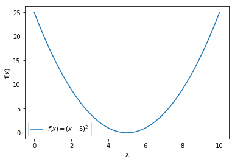

# Brute-force minimization

In this section we're going to look at how to numerically find the values of variables that either maximize or minimize functions in Python. For example, the function *f(x) = (x−5)<sup>2</sup>* shown in the plot below has a minimum at *x = 5*.  Though this specific example is easily solved using simple calculus, this is not true for all functions and numerical methods must be used instead.  However, to verify that these methods do in fact work, we're going to test them on this function where we do know the answer.



The most straightforward way to find the minimum of simple functions is using a *'brute-force'* approach. Here the value of the function is computed for each point on a (potentially multi-dimensional) grid of parameters. The minimum can then be found using these calculated values. As a simple example, we will use Python to find the minimum of *f(x) = (x−5)<sup>2</sup>* for *x ∈ [0,10]*. To do this, we first create an array of x-values that cover the desired range, then caclulate the corresponding values of *f(x)* (which we call y in this piece of code):.

``` python
import numpy as np

x = np.linspace(0, 10, 101) # range over which function is calculated
y = (x - 5)**2 # function to be minimized
```

Finding the value of x which minimizes y is then a two-step process.

* First, you find the index of the minimum value of the array y using the `np.argmin()` function (this is not to be confused with the `np.min()` function which returns the minimum value of an array).
* Then, you find the corresponding value of x at that index, i.e. `x[np.argmin(y)]`.

``` python
In [2]: print(f"Function has a minimum at x = {x[np. argmin(y)]}")
```

``` python
Function has a minimum at x = 5.0
```
Though this approach is conceptually straightforward, the downside is that it is inefficent. First, it involves evaluating the function many times - one time for each grid-point. For many practical problems, especially ones with many variables, this can either take a long time to run or be limited by the memory available on your computer.