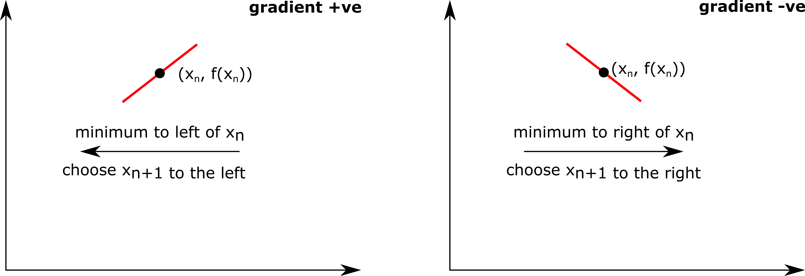
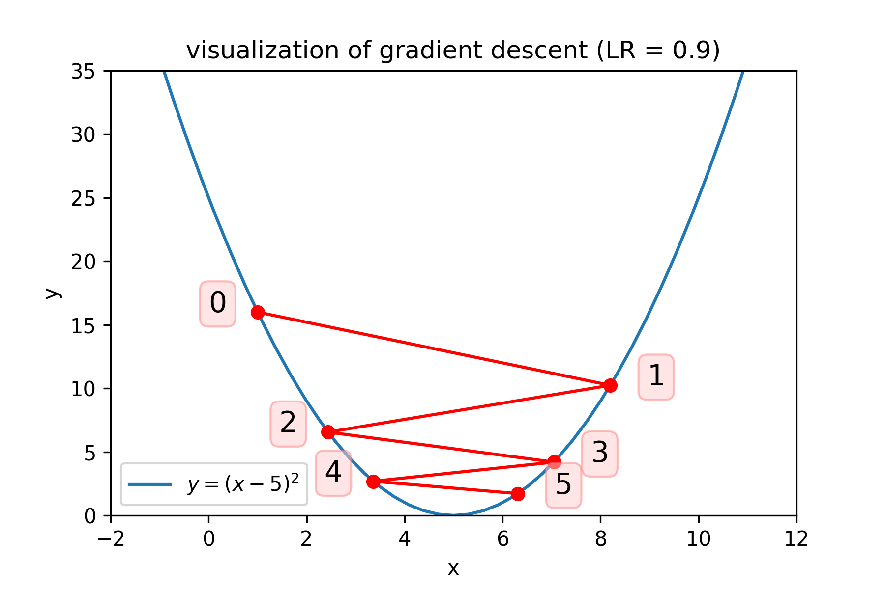
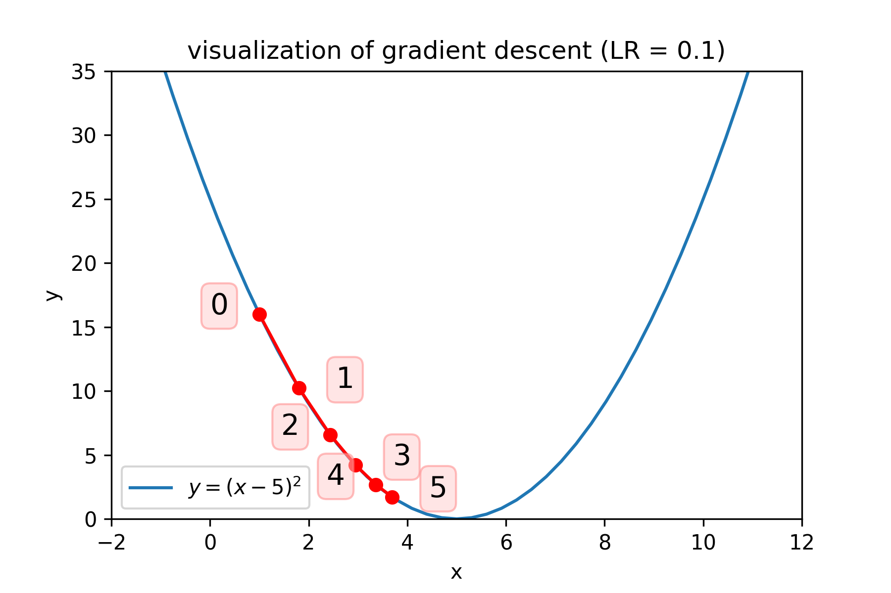
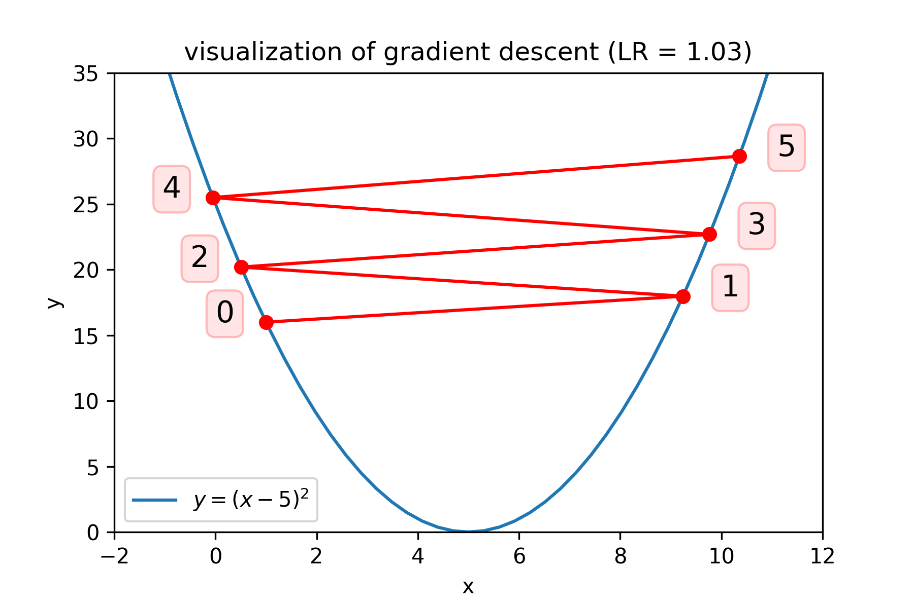

# Gradient descent minimization

Gradient descent is an extremely popular iterative optimization algorithm, used to find the local minimum of a function. For a function of one variable *f(x)* , you start with an initial value *x0*, and the iteration goes like

*xn+1 = xn - γf'(xn)*

Here *γ* is the *'learning rate'* and *f'(xn)* is the value of the gradient of the function you wish to minimize *df/dx* evaluated at *xn*.  Gradient descent in 1D is quite intuitive

* if *df/dx* at *xn* is **positive**, then you want to take a step to the **negative** direction
* if *df/dx* at *xn* is **negative**, then you want to take a step to the **positive** direction
* The greater the gradient, the larger step you want to take in that direction

This is illustrated in the figure below.  Here we always want our iterations to move towards lower values for the function.

If you change the negative sign in the above equation to a positive sign, you would get the iteration for the gradient ascent algorithm which finds the local maximum of a function. For simplicity however we're just going to focus on gradient descent. 

To illustrate this algorithm, we will again look at the function *f(x) = (x−5)2* , which has a gradient *f'(x) = 2x−10* , and perform a few iterations 'by hand'. Here we'll start with an initial value  *x0 = 1* and a learning rate *γ = 0.9* If we have chosen *x0* and *γ* appropriately, this process should tend towards the minimum value of *x=5* after a large number of iterations.

|i|x|
|---|---|
|0|*x0 = 1*|
|1|*x1 = x0 - γf'(x0) = 8.2*|
|2|*x2 = x1 - γf'(x1) = 2.44*|
|3|*x3 = x2 - γf'(x2) ≈ 7.05*|
|4|*x4 = x3 - γf'(x3) = 3.36*|
|5|*x5 = x4 - γf'(x4) ≈ 6.31*|

Here you see successive iterations are getting closer and closer to the expected value of *x = 5*. The figure below shows a visualization of the values of *x* we have iteratively calculated.

Here you see that wherever the gradient is negative (i.e. for *x < 5* in this case), the value of *x* is increases (i.e. moves to the right) in the next iteration. Conversely, wherever the gradient is positive (i.e. for *x > 5* in this case), the value of *x* is decreased (i.e. moves to the left) in the next iteration. Note also that the greater the gradient, the larger the adjustments will be made to *xn*. Whenever we approach the minimum value, the gradient tends towards zero and the adjustment becomes progressively smaller.

The adjustment can also be adjusted by modifying the learning rate, *γ* but care must be taken when choosing its value. if you choose too small a value, then it can take a large number of iterations for gradient descent to converge. If you choose too large a value however, gradient descent can overshoot the minimum, fail to converge or diverge.  Three different learning rates for our example are shown below.

