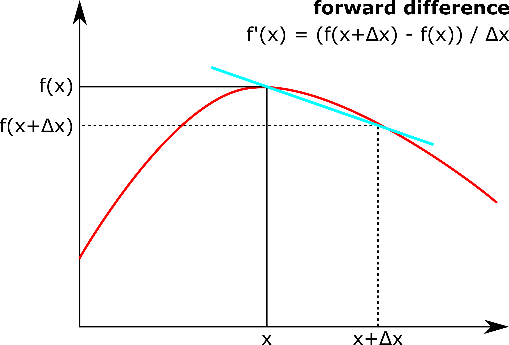
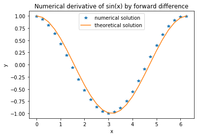
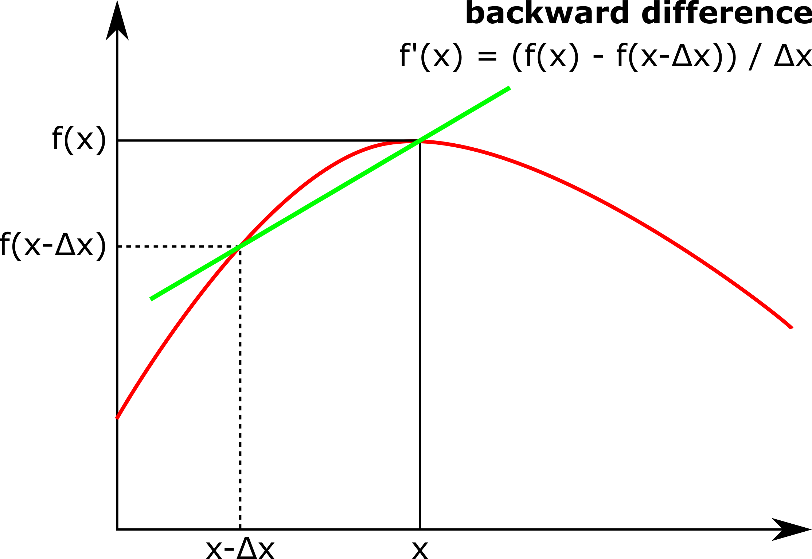
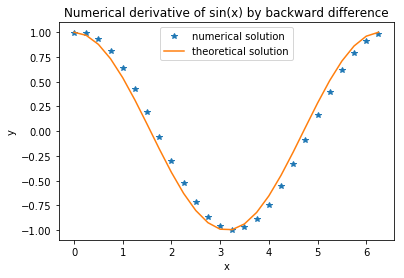
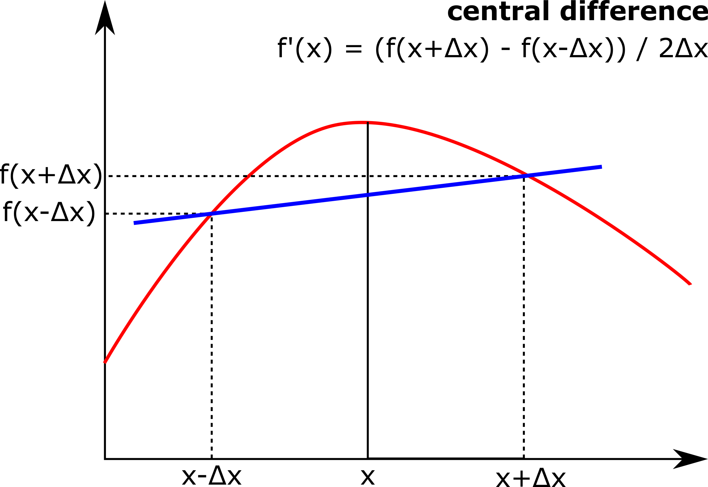
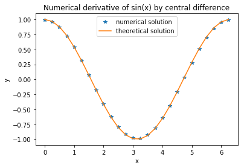

# Forward, backward and central difference methods

In this section, we're going to look at ways to numerically approximate the derivatives of functions. 

## Forward difference

You may recall that the mathematical definition of the derivative of a function *f* at a point *x* is defined by the limit:

.

If we instead take *Δx* to be finite, then we can get an approximation of the derivative (this is known as a *'forward difference'*) as

.

This numerical approximation of the derivative is illustrated in the figure below.  As *Δx* gets progressively smaller, this tends to become closer to the true derivative.



One way that this can be implemented in Python (for differentiating simple mathematical functions) is as follows:

``` python
import numpy as np
import matplotlib.pyplot as plt

def forw_diff(f,x,dx):
    """ calculates derivative of f at x, for step size dx using forward difference method"""
    return (f(x+dx)-f(x))/dx

def f(x):
    """returns the value of the function sin(x)"""
    return np.sin(x)

dx = 0.25 # step size used for differentiation

x = np.arange(0, 2*np.pi, dx) # creates an array between 0 and 2 pi with step size dx

plt.plot(x, forw_diff(f, x, dx), '*') # plots results of numerical differentiation
plt.plot(x, np.cos(x)) # plots theoretically correct line
plt.legend(["numerical solution", "theoretical solution"])
plt.xlabel("x")
plt.ylabel("y")
```

Which gives the output



## Backward difference

Similarly, derivatives by a 'backward difference' can also be calculated via the following equation which is also illustrated below:

.




By implementing this method to the code above (try doing this) you can get the following output:



## Central difference

By taking the average of forward and backwards difference methods you get the *'central'* difference which in general gives a much better approximation of the derivative:

.




If you also try implementing this method to the code above you get the following output:

