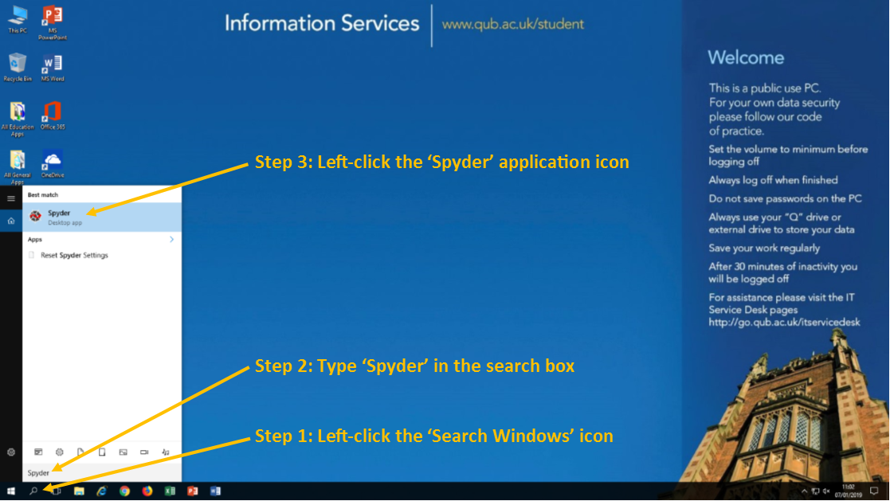
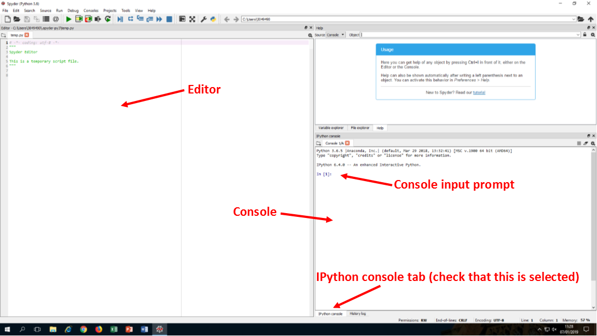

# Using Python as a basic calculator

## The Spyder IDE

### Opening the Spyder application

In this course, we're going to use the *'Spyder'* application which is especially useful for scientific programming.  Spyder is an acronym (sort of!) for '**S**cientific **PY**thon **D**evelopment **E**nvi**R**onment'.

To open this program, click the *'Search Windows'* icon on the bottom-left corner of your desktop, type *'Spyder'* and left-click the *'Spyder'* icon that appears. The application may take a few moments to open.



When the application is opened, have a look around the main window and you'll see that it consists of a variety of *'panes'*. The default layout is shown below. 



The two most important panes at this stage are the *'console'* (on the bottom-right) and the *'editor'* (on the left). 

* The **console** allows you to input Python commands one at a time and, if applicable, shows you the results immediately. The console is most useful when learning new concepts and trying out different ideas.  We will start off by using the console.
* The **editor** is used for grouping multiple Python commands together into programs. This acts similarly to text editors such as Notepad, in that you can type your code, save the file (which will have a .py extension) and make edits when required. When you run the .py file, the lines of code will be executed sequentially. Note that the results of calculations performed here will not be immediately shown in the console (but can be outputted using the `print()` function discussed later).

## Fundamental mathematical operations in Python

To begin, we're going to use the *'Console'* pane (which is in the bottom-right corner of the window) as a simple calculator. We can use the `+` , `-` , `*` , `/` operators in the usual way for addition, subtraction, multiplication and division, respectively. Exponentiation is performed using the `**` symbol, so you would write 3<sup>2</sup> as `3**2` in Python.  The order in which these operations are carried out is the same as that used in mathematics, but the use of parentheses `()` is recommended to avoid ambiguity.

Left-click on the console pane, beside the `In [1]:` prompt, type `1 + 1` and then press the 'enter' key on your keyboard. The console should now read `Out[1]: 2`. Congratulations, you have now issued your first Python command! After you input a command and press enter, new prompt is automatically generated in the console, `In [2]:` and you are free to type in further expressions. The integer number inside the square brackets only indicates the number of commands you have issued so far and doesn't affect how the code runs at all.
Syntax errors

If you make a typo in your input and the expression doesn't make sense to the interpreter (for example, try entering `1 + 1 +`) the console will return an error telling you where it occurred what went wrong.

```python
In [1]: 1 + 1 +

File "<ipython-input-1-fd659da33d23>", line 1

1 + 1 +

^

SyntaxError: invalid syntax
```

It's important to gain familiarity with many different types of error during this course (this particular one is a called a SyntaxError). When you're writing more complex programs, this automatic error reporting becomes a very useful feature if they do not run as expected!

 
## Exercise 1: 

Perform the following calculations in the Spyder console and verify that the answers are what you expect.

* 24 - 173
* 20 × 5
* 19 ÷ 4
* 3<sup>4</sup>
* 6 + 20 × 5
* (6 + 20) × 5


The answers to this and the following exercises may be found [here](solutions.md).

[Next: Variables and data types in Python](variables-datatypes.md)
