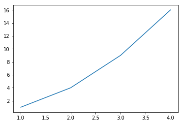
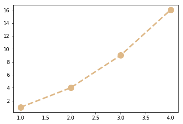
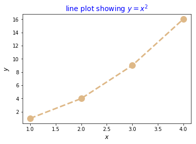
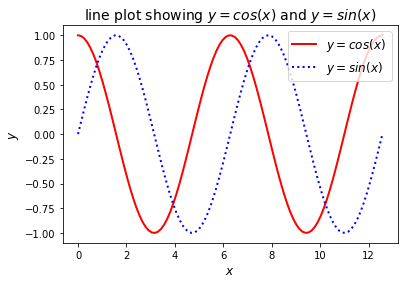

# Plotting data in Python

## Using the Spyder editor

Now is a good time to start using the Sypder editor. This allows larger programs to be written, saved and reused later. To use the editor, simply type Python code into the pane on the left of your screen, and press the F5 key on your keyboard. You should then click `Run' on the dialogue box if it appears. If you wish to run the file again later, you should save it on your Q: drive.

## Printing to the console 

The `print()` function is used to output messages or data to the console window. One way is to simply type a string inside the parentheses e.g. `print("Hello world")`. You can also print variables, e.g. if we set `my_var = 42` then `print(my_var)` would output `42` to the console.

You can print both strings and variables together.  There are two main ways of doing this.  Firstly, you could separate the string from the variable by a comma e.g. `print("The answer is",  my_var)`.  Alternatively, you can use what's known as a *'formatted string literal'* by prefixing the string with the letter `f` and enclosing the variables in curly braces, e.g. `print(f"The answer is {my_var}")`.
 
## Commenting your code

You can add comments to your Python commands and in the editor using the `#` character. Anything you type after the `#`, until the end of the line, is ignored by Python and does not affect how the code runs.

``` python
In [8]: 3 ** 4 #calculates 3 to the fourth power

Out[8]: 81
```

Comments are mainly used to describe to other programmers (or to yourself at a later date) what a piece of code does. The above example is of course trivial, but as pieces of code get more complex, their purposes can become less obvious and commenting becomes essential.


# Plotting 1D graphs

## Basic line plotting

To plot our data, we're going to use the `matplotlib.pyplot` module, which is usually imported using the alias `plt`. Plotting a basic line graph using this package is very easy - simply use the command `plt.plot(x, y)`, where `x` and `y` are one-dimensional arrays. For example, to create a plot of the function y = x<sup>2</sup> for the integers x = 1, 2, 3, 4, run the following code from the Spyder editor.

``` python
import numpy as np
import matplotlib.pyplot as plt # imports the plotting package under the alias 'plt'

x = np.array([1, 2, 3, 4]) # creates an array of the integers between 1 and 4
y = x ** 2 # creates another array for which each element is the square of the corresponding element in the array x

plt.plot(x, y) # plots y versus x
```

When the above code is executed, the following figure will appear in the console.

## Modifying curve appearance

You can change the appearance of the plot using the `color`, `linestyle`, `linewidth`, `marker` and `markersize` parameters. You do so by passing these parameters into the `plt.plot()` function.   Note that you pass the `color`, `linestyle` and `marker` parameters as strings, whereas the `linewidth` and `markersize` parameters are passed as numbers.

`linestyle` parameters include `` `'-'` or `'solid'` for a solid line, `'--'` or `'dashed'` for a dashed line, `'-.'` or `'dashdot'` for a dash-dotted line, `':'` or `'dotted'` for a dotted line or `''` or `'None'` for no line.

`marker` parameters include `'.'` for points, `'o'` for circles, `'+'` for plus signs `'x'` for crosses and `'*'` for stars.

A list of the `color` parameters can be found on the [matplotlib website](https://matplotlib.org/3.1.0/_images/sphx_glr_named_colors_003.png).

For example, the following code gives the plot appearance shown below:

```python
plt.plot(x, y, color = 'burlywood', linestyle = 'dashed', linewidth = 3, marker = 'o', markersize = 12)
```


## Axis labels and plot titles

No plot is complete without proper labeling and `matplotlib.pyplot` provides functions that do this easily. Simply pass your desired labels and title as a string to the appropriate function. The `fontsize` and `color` parameters can also be used in labeling. For example, if you include the following code to your script you get the plot below:

``` python
plt.xlabel('$x$', fontsize = 12)
plt.ylabel('$y$', fontsize = 12)
plt.title('line plot showing $y = x^2$', fontsize = 14 , color = 'blue')
```



## Mathematical notation in text

Here the dollar `$` signs in the title are used to enclose *'mathematical notation'*, which allows superscripts using the `^` symbol, e.g. `$x^2$` shows on the label as x<sup>2</sup>. Many other useful characters can also be used in this way (e.g. Greek characters like ω can be shown on your labels by typing `$\omega$`). A list of such symbols is given on the [matplotlib website](https://matplotlib.org/users/mathtext.html).

## Plotting two graphs on the same axes, and setting a plot legend using `plt.legend()`

To plot two graphs on the same axis, simply call the `plt.plot()` function twice as shown in the example below. Legends can be added by using the `plt.legend()` function, which takes a list of strings as its argument.  Note also that this is an example of how useful the `np.linspace()` function can be at creating arrays.

``` python
import numpy as np
import matplotlib.pyplot as plt

x = np.linspace(0, 4*np.pi, 100) # creates an array of 100 equally spaced numbers between 0 and 4*pi

y = np.cos(x)
y2 = np.sin(x)

plt.plot(x, y, color = 'red', linestyle = 'solid', linewidth = 2)
plt.plot(x, y2 , color = 'blue', linestyle = 'dotted', linewidth = 2)
plt.xlabel('$x$', fontsize = 12)
plt.ylabel('$y$', fontsize = 12)
plt.title('line plot showing $y = cos(x)$ and $y = sin(x)$', fontsize = 14)
plt.legend(['$y = cos(x)$','$y = sin(x)$'], fontsize = 12)
```



## Setting x and y limits of plot using `plt.xlim()` and `plt.ylim()`

If you wish to restrict the axes to a specic set of values you can use the `plt.xlim()` and `plt.ylim()` functions which take a list of two numbers as their arguments, e.g. if you wanted to restrict the axes in the above plot you could include something like

```python
plt.xlim ([1.5, 3.5]) # sets range of the x- axis to between 1.5 and 3.5
plt.ylim ([0, 1]) #sets range of the y- axis to between 0 and 1
```

To save your figure, simply right-click on the figure and click "Save Image As..."

 
## Exercise 4:

A Gaussian function has the form *y(x)= ae<sup>(x-b)<sup>2</sup>/2c<sup>2</sup></sup>* for real constants *a*, *b* and non-zero *c*.  The full width at half maximum of the Gaussian may be calculated as *fwhm = 2c(2 log 2)<sup>0.5</sup>*.

Plot a Gaussian function that has an amplitude of *10*, is centered on *0* and has an FWHM of *3*.  To do this:

* Create a new file in the Spyder editor (i.e. File  ⟶ New file...) and immediately save it on your Q: drive.
* In this file
    * import the `numpy` and `matplotlib.pyplot` modules
    * create an array called `x`, which consists of `1000` evenly spaced numbers between `-10` and `10` using the `np.linspace()` function
    * create three new variables: `a = 10`, `b = 0`, `fwhm = 3`
    * create a new variable `c`, whose value is calculated from the given equation for the Gaussian fwhm
    * create a variable `y`, which defines a Gaussian equation with your variables
    * plot `y` as a function of `x`, adding appropriate axis labels

    [Next: Writing more complex programs using control flow](control-flow.md)